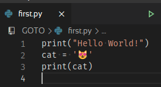
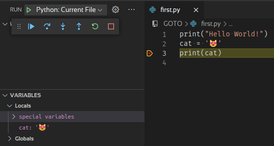
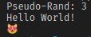

# Python GOTO

Simple Python kickoff

Python is a general-purpose, multi-paradigm, interpreted programming language,  with a dynamic, strong typing system. To support developers is aims for reflection.

Reflective programming or reflection is the ability of a process to examine, introspect, and modify its own structure and behavior.

## Installing Python on Arch-Linux

`sudo pacman -S python`  
The python package installs CPython.

## VSCode integration

extension  

    ms-python.python

Enable for workspace only suggested.

## Hello World

```python
print("Hello World!")
cat = '😻'
print(cat)
```

run:  

`python first.py`

or press the green arrow:  


output:  


## Debug



## Package Management

pip — The official package installer for Python.  
Python Package Index (PyPI)  
<https://pypi.org/>

Other package managers:  
- Anaconda
- Miniconda


## Modules

`pip install $some_pkg`  
`pip uninstall $some_pkg`  

## Dependencies

```python
# main.py
import random
import hello

print("Pseudo-Rand:",random.randint(1, 11))
hello.print_hello()
```

```python
# hello.py
def print_hello():
    print("Hello World!")
    cat = '😻'
    print(cat)
```



# Debug


## Comments

\# line comment  
""" block comment """

[PEP 257 -- Docstring Conventions](https://www.python.org/dev/peps/pep-0257/)

## Variables

- **Python has no keyword to declare variables.**
- Variable names are case-sensitive.

```python
x = 5
y = "John"
print(type(x))
```

## Constants

You cannot declare a constant.

## Types

Built-in Data Types

```text
Text Type:      str
Numeric Types:  int, float, complex
Sequence Types: list, tuple, range
Mapping Type:   dict
Set Types:      set, frozenset
Boolean Type:   bool
Binary Types:   bytes, bytearray, memoryview
```

## Scalars

The commonly used scalar types in Python are:

- `int` Any integer.
- `float` Floating point number (64 bit precision)
- `complex` Numbers with an optional imaginary component.
- `bool` True, False
- `str` A sequence of characters (can contain unicode characters).
- `bytes` A sequence of unsigned 8-bit entities, used for manipulating binary data.
- NoneType (`None`)
- Python’s `null` or `nil` equivalent, every instance of `None` is of NoneType.

## Numeric Types

- integers
- floating point numbers
- complex numbers `complex(x, y)` | `real()` | `imag()`

## Integer Literals

`<class 'int'>`

- Integers have unlimited precision.

    Decimal         255
    Hex             0xff
    Octal           0o377
    Binary          0b11111111

- `bin()`
- `hex()`
- `int()`
- `oct()`

## Floats

`<class 'float'>`

- Floating point numbers are usually implemented using double in C;

```python
import sys
sys.float_info
```

```python
y = 3.0
x = float(3)
```

## Booleans

`<class 'bool'>`

Booleans are integers:  

```python
x = bool(1)
```
    True

```python
x = True
x = False
```


## Characters

Python does not have a character or `char` type. All single characters are `strings` with length one.

## Strings

`<class 'str'>`  

- can be initialized by using single or double quotes
- Strings are `Lists` (Arrays)

```python
a = "Hello, World!"
print(a[1])
len(a)
```

```python
for x in "banana":
  print(x)
```

## Collections

- sequence of objects

### Tuple

`<class 'tuple'>`

- duplicates
- immutable
- ordered

```python
tup1 = ('physics', 'chemistry', 1997, 2000)
tup2 = "a", "b", "c", "d"
tup1[0] # Output: 'physics'
```

### List

`<class 'list'>`

- duplicates
- mutable
- ordered

```python
my_list = ['foo', 4, 5, 'bar', 0.4]
```

### Set

`<class 'set'>`

- immutable
- unordered and unindexed
- no duplicates

```python
myset = {"apple", "banana", "cherry"}
```

### Dictionary

`<class 'dict'>`

- key:value pairs
- mutable
- no duplicates
- ordered (since Py 3.7)

```python
thisdict = {
  "brand": "Ford",
  "model": "Mustang",
  "year": 1964
}
```

## Arrays

No built-in support, but Lists can be used instead.

## Functions

```python
// params (input)
def foo(name):

// return values | results ( output)
def my_function(x):
  return 5 * x
```

## Control Flow

### if...else

```python
 if x < 0:
     x = 0
     print('Negative changed to zero')
 elif x == 0:
     print('Zero')
 elif x == 1:
     print('Single')
 else:
     print('More')
```

### while loops

```python
index = 0
while index < 10:
    print(index, end=' ')
    index += 1
```

### for loops
```python
words = ['cat', 'mouse', 'dog']
for word in words:
    print(word, len(word))
```

## References

https://www.python.org/

https://wiki.archlinux.org/index.php/rust

https://en.wikipedia.org/wiki/Python_(programming_language)

https://code.visualstudio.com/docs/python/python-tutorial

https://docs.python.org/3/reference/

https://wiki.python.org/moin/BeginnersGuide
